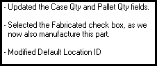

Adding Revision Comments

# Adding Revision Comments

After changing the revision number of a part record
and clicking the Save button, the Revision
ID change Comments dialog box appears.

1. After modifying the
   part record as necessary, click the Config
   Mgt tab and enter a new revision for the part into the
   Revision ID field.
2. Click the Save
   button or select Save from the File
   menu.

The [Revision
ID Change Comments](Prompting_for_Part_Revision_Comments.htm) dialog box appears.

3. Enter text for the revision
   into the field and click the Ok button.
   For example:

The comments are saved to the Revision ID.

For more information on viewing archived
comments, click [here](Viewing_Revision_Comment_Histories_.htm).

 User-defined Help