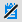
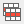
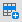
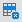

Common Toolbars

# Common Toolbars

Some toolbar buttons are common to nearly every VISUAL
window. They are shortcuts for options found mostly under the File,
Edit and Notes menus. These common buttons allow you to perform such
basic but important tasks as saving, deleting, clearing, printing,
refreshing, and inserting new lines. Most of these buttons are found
on main toolbars. Table toolbars also feature common buttons, but
tend to hold more specialized, application-specific buttons. This
section describes the most prevalent buttons.

## Main Toolbar

 Save
- The Save button saves information presently in the window you are
using. VISUAL saves unless you have entered an incomplete record.

 New - The New button
clears the window and prepares it for a new document.

Refresh - The Refresh button refreshes the display in the current
window from the database.

 Delete - The Delete
button allows you to delete the document you are currently viewing.
Be sure you want to delete the document before proceeding; VISUAL
asks you to confirm as a safeguard.

  Documents - Click this button to view the documents
attached to the record or to add more documents. If no document is
attached, a diagonal is displayed on the icon.

Print - A Print button allows you to print
the document you are currently viewing. In most cases, you can also
print a range.

 Previous - In some
windows, such as Vendor Maintenance, the previous button allows you
to call up the vendor previous to the vendor currently in the window.
VISUAL uses alphabetic order to display the previous vendor.

 Next - In some windows,
such as Vendor Maintenance, the next button allows you to call up
the next alphabetic vendor into the window.

  
  
 
 
Notations - Click a notations button to
view existing notations or add new notations for an order, customer,
vendor, or other document/object in the database. In some windows,
you can add more than one type of notation. In these windows, the
system displays Notation buttons which are differentiated by color
or by a user image. If there are no associated notations, a diagonal
line displays on the notations toolbar button.

 
 
 
 
 
Specifications - Click a specifications
button to add a specification to the record or add a new specification.
In some windows, you can add specifications to both the header information
and to the individual lines in the line item table. If there are no
associated specifications, a diagonal line displays on the specifications
toolbar button.

Send To - Click this button to e-mail the
information in the window.

 View Data Source - This button is available
in selected windows and is active for users with system administration
privileges. Click this button and then click an object on the window
to view the database table and column that supplies the information
in the object. See [Viewing the
Data Source](Viewing_the_Data_Source.md).

## Table Toolbar

 Insert Line
- The Insert Line button lets you insert a line into an entry applications
line item table. For example, to add a line to a customer order in
Customer Order Entry, click this button.

 Delete Line - The
Delete Line button lets you delete a line from an order/document.
Select a line and click the Delete button
to remove a new line from the table.

 
Line Specs - The Line Specifications button
lets you to enter specs for individual line items. If there are no
associated specifications, a diagonal line displays on the specifications
toolbar button.

 Picture - The picture
button allows you to associate a bitmap to a line item. For example,
you can attach a picture of a part/material/service to a purchase
order line.

 Repeat
Row - The Repeat button lets you repeat a lines information.
VISUAL adds an identical line to save you the time of reentering the
same information.

 User-defined Help