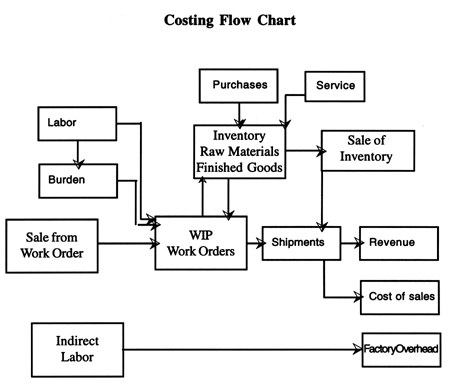

Costing Flow Chart

# Costing Flow Chart

Direct Labor is reclassed from Payroll to Cost of
Sale - Direct Labor Accounts.

Indirect Labor is reclassed from Payroll to Manufacturing Indirect
Payroll.

Cost Flow Procedure

 User-defined Help