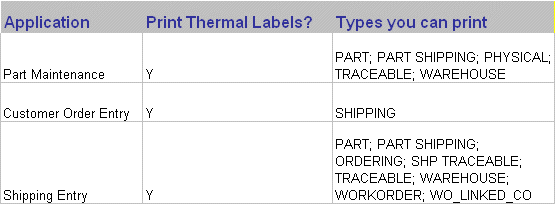

Creating Individual Thermal Labels

# Creating Individual Thermal Labels

The Label Printer Setup Utility allows you to create
thermal labels to use when shipping containers.

|  |  |
| --- | --- |
| IMPORTNT.gif | The process of creating thermal labels that contain VISUAL database fields involves a 3rd party piece of software. [Loftware](http://www.loftware.com/), a complete barcoding software solution, must be present on at least one client machine before you can create .lwl files. Lwl files allow VISUAL to associate the fields in the label you design using Loftware with VISUAL database fields. For more information on implementing Loftware and designing labels, contact your Infor Global Solutions Partner. Also, ask your associate about the Infor Global Solutions Barcoding manual, a comprehensive guide to implementing, designing, and effectively using barcoding systems throughout your enterprise chain. |

In addition to the label types available in previous
versions of VISUAL, a new type, PART\_SHIPPING, is available to automotive
users.

The PART\_SHIPPING table allows you to enter selected data for a
given Part ID, combined with a given Ship To ID, for a given Customer
ID. The Customer ID is not required as part of the key in this table
if the Shipto ID is unique within the CUST\_ADDRESS table, and is not
a combined key with the Customer ID.

1. From the Admin menu,
   select Labels Printer Setup Utility.

The Barcode Label Printer Setup Utility
window appears.

2. In the Label ID field
   enter an ID for the label. To modify an existing Label ID, click
   the Label ID button to browse the LABEL\_FORMAT field.
3. Enter a description
   of the Label ID into the Description field. Click the Description
   button to choose an existing description. Choosing an existing
   description prompts VISUAL to auto-fill the Label ID field with
   the associated Label ID.
4. Click the Label
   File button to choose the Loftware label file you want
   to use for this label. These files have an extension of .lwl.
   For more information, consult your Loftware documentation.

If you have run the necessary print on demand
utility (see your Loftware documentation) the fields on the Loftware
label appear in the Data type fields.

From the Label Type list box, select the
label type. Label type PART\_SHIPPING is new for release 6.3, and is
used primarily for automotive shipping labels.

The chart below lists the applications automotive
users most often use, and the types of labels you can print from those
applications.

After selecting a label type, VISUAL displays
all available data tables in the Available Data Tables list box.

5. From the Label Printer
   list box, select the thermal label printer you want to use to
   print the label.

   |  |  |
   | --- | --- |
   | POSTIT.gif | You must install thermal labels printers before you can print to them. |

6. In the Copies field,
   enter the number of copies of this label you want VISUAL to print
   to the thermal printer. This becomes the default.
7. Begin to associate VISUAL
   database fields to the Loftware fields by using the left and right
   arrow keys or dragging and dropping fields onto The Selected Data
   Field field and the Loftware Label field.
8. Click the Save
   button or select Save from the File
   menu to save the label.