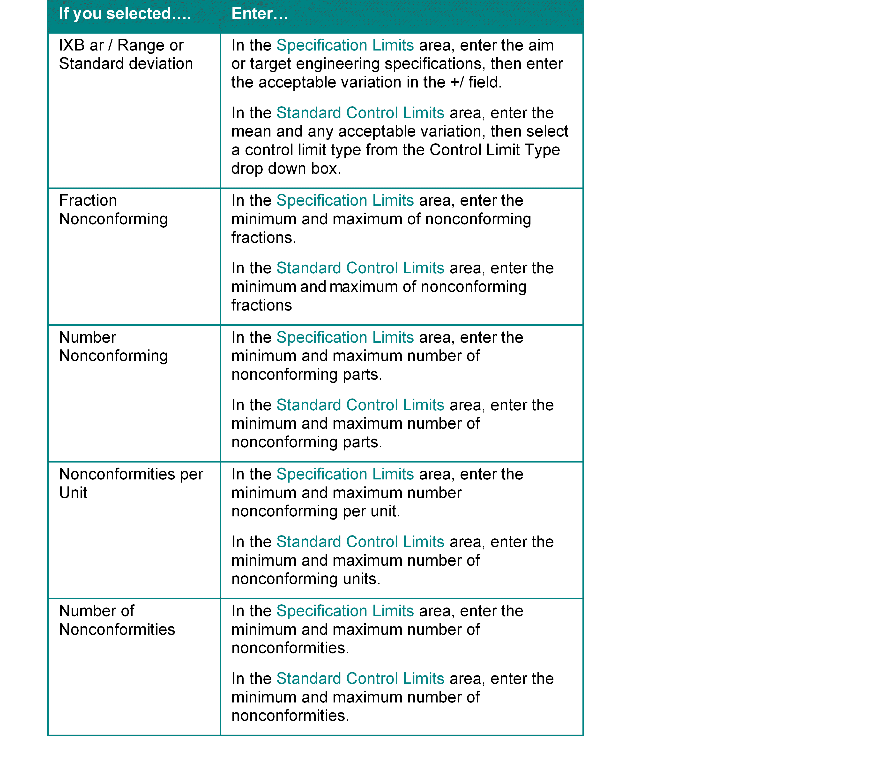

Defining New Tests

# Defining New Tests

Use Test Definition to define new tests.

1. In the Test ID field,
   enter a new test ID.
2. In the Description field,
   enter a description for the new test.
3. From the Status drop
   down box, select the status for the new test.

You can select Active, Inactive, or Mark
Deleted.

4. Click the Insert
   button to define the test.

The Test Step Definition dialog box appears.

The test ID, step number, and sequence number
information appears automatically at the top of the dialog box.

5. In the Description field,
   enter a description for the test step definition.
6. In the Characteristic
   field, enter the appropriate dimension description.

You can also click the Characteristic
button and select a dimension from the Browse for Dimensions table.

7. Select the appropriate
   dimension type from the Dimension Type drop down box.

You can select: Mean, +/-; Min/Max, or Max\Min.

8. In the Test Step Type
   area, select the appropriate test step type radio button.
9. Enter the appropriate
   information in the Specification Limits and Standard Control Limits
   areas. The information in these areas changes depending on the
   test step type radio button you select.

See the table below to determine what information
you should enter for the test step type you have selected.

10. In the Frequencies area,
    enter the subgroup size (i.e. number of measurements per subgroup)
    and the sample size.

The sample size is the group from which
subgroup size measurements are take.

For example, if you have 5 as a subgroup
size and 10 as a sample size, the test inspects five out of ten pieces.

11. In the Classification
    field, enter the defect classification for this test.

You can click the Classification button
and select a classification from the Defect Classification Coding
table.

12. In the Gauge ID field,
    enter the appropriate gauge ID for the test.

You can click the Gauge
ID button and select a gauge from the Gauge Methods table.

When you select a gauge ID, the gauge description
appears in the Gauge Desc field.

13. Click Ok
    to save the new test.

 User-defined Help