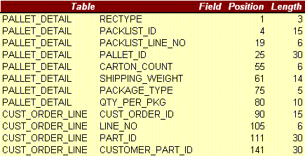
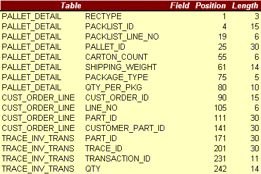
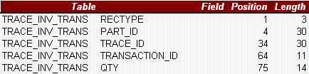

Including Trace IDs when exporting ASN data

# Including Trace IDs when exporting ASN data

When shipping in VISUAL, you click the Part Traceability
icon to assign Trace Ids to the parts you are shipping.

Your EDI Trading Partner may require you to include those Trace
Ids (referred to often as either serial numbers or lot numbers) with
your ASN data.

When you export your ASN Pallet Details (contained on the 5 th tab
of your ASN layout), you can have VISUAL export the Trace information
as well.

In order to include Trace Ids with your exported ASN data, follow
the steps below:

1. In your ASN layout (ASN0001
   is our example here) in Vmdigen, click the Data button for each
   tab and select the fields you will be exporting. Click Save. Repeat
   the step for each of the five tabs.
2. Associate the layout
   with one or more customers.
3. Click the fifth tab
   (Adt Line Item) and notice that the tables listed are: PALLET\_DETAIL
   and CUST\_ORDER\_LINE.
4. In the blank field located
   above the Add button, type: TRACE\_INV\_TRANS and click the ADD
   button.
5. Click the Data button
   and your selected fields will look something like this (depending
   upon what fields you chose):

6. Now select the Trace
   fields so that your field selections look something like:

7. Click OK
   and Save the layout. You do NOT need to set up any joins for this
   table addition these joins have all been done inside the program
   code itself.

When you run VMDI Exchange to export out
your ASN data, the Trace Ids you assigned to your shipped parts will
be exported also. However, instead of the Trace Ids being exported
as part of the ASL (Additional Line Item) records, they will actually
be exported as ASX (Trace) records.

So, if you were to export ASN 0001 layout
using the fields selected in step 6, the Header (HDR) "H",
Header Special Detail (SDL) "D", Line Item (LIN) "L",
and Sub Line Item (SUB) "S" records would all export however
you had selected them. The Adt Line Item (ASL)"A" would
be handled differently in that the PALLET\_DETAIL and CUST\_ORDER\_LINE
fields will be exported as the "A" records and the TRACE\_INV\_TRANS
will be exported as the (ASX) "X" records. See example below:

ASX

The six ASN files are named as follows (where
0001 is the version of your layout):

ASN0001H.VDI Header (HDR records)

ASN0001D.VDI Header Special Detail (SDL
records)

ASN0001L.VDI Line Item (LIN records)

ASN0001S.VDI Sub Line Item (SUB records)

ASN0001A.VDI Additional Line Item (ASL records)

ASN0001X.VDI Trace (ASX records)

Single file:

ASN0001.VDI Contains all of the above records
in a single file.

|  |  |
| --- | --- |
| POSTIT.gif | If you are setting an EDI map in a 3rd-party mapping application, you will want to set up the ASL and ASX records as separate records. |

 User-defined Help