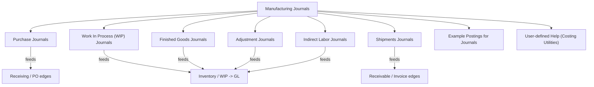

Manufacturing Window — Condensed README

Overview

The Manufacturing Window is Infor VISUAL's master engineering and production-management application. It provides master process definition (engineering/quote masters), work order creation, and integration to scheduling, material planning, purchasing, and order management. The window captures both as-planned and as-built data and is the central place to define and execute manufacturing processes.

Quick Navigation (TOC)

- Manufacturing Window Concepts — `Manufacturing_Window_Concepts.md`
  - Engineering Masters — section in `Manufacturing_Window_Concepts.md`
  - Quote Masters — section in `Manufacturing_Window_Concepts.md`
  - Work Orders — section in `Manufacturing_Window_Concepts.md`
- Understanding the Manufacturing Window Display — `Manufacturing_Window_Viewing_Options.md`
  - Graphical / Text / Grid views
  - Two-window views (materials panel)
  - Size and Color Preferences
- Starting the Manufacturing Window — `Starting_the_Manufacturing_Window.md`
- Using the Manufacturing Window — `Using_the_Manufacturing_Window.md`
- Operations (detailed fields) — `Adding_Operations_to_a_Quick_Quote.md`
- Material Requirements — `Adding_Material_Requirements_to_an_Operation_in_Quick_Quote.md`
- Co-Products & Allocation — `Allocating_Co-products_to_Demand.md`
- User-defined Help — `User_defined_Help_Files_Manufacturing_Window.md`

Important integration note (contextual index)

- Manufacturing Journals are a central/top node in the manufacturing dataflow. In our documentation and data models the Manufacturing Journal node acts as the top node for the following edges:
  - Receivable (posting of sales / revenue derived from manufactured goods)
  - Invoice (customer invoicing events tied to shipments/fulfillment)
  - Receiving (material receipts and inbound transactions leading to production)

  When mapping system tables or constructing DDLs, treat `Manufacturing Journals` as the aggregation point that links manufacturing activity to financial and inventory edges (receivables, invoices, receiving records).

Repository & data model pointers (context)

- Converted help content (HTML -> Markdown): `Documentation/Help-md/VM/` (converted from `Visual Mfg Help Files/VM/`).
- Authoritative DDL extracts (per-table CREATE scripts): `Documentation/Data Models/ddl/schema-extract/output/LIVE/`.
- Guessed templates (backed up): `Documentation/Data Models/ddl/templates_backup/`.

---

Manufacturing Journals index (top node)

- Top node: `Documentation/Help-md/VM/Manufacturing_Journals.md`
  - `Documentation/Help-md/VM/Purchase_Journals.md`
  - `Documentation/Help-md/VM/Work_In_Process_WIP_Journals.md`
  - `Documentation/Help-md/VM/Finished_Goods_Journals.md`
  - `Documentation/Help-md/VM/Shipments_Journals.md`
  - `Documentation/Help-md/VM/Adjustment_Journals.md`
  - `Documentation/Help-md/VM/Indirect_Labor_Journals.md`
  - `Documentation/Help-md/VM/Example_Postings_for_Journals.md`
  - `Documentation/Help-md/VM/User_defined_Help_Files_Costing_Utilities.md`

Mermaid graph (Manufacturing Journals → edges)

You can click the file links above (they are in the same folder) to open the detailed pages for each journal.

Suggested next steps

- Review sample converted markdown files under `Documentation/Help-md/VM/` and adjust link/image paths if needed.
- If you want this README inserted elsewhere or committed to repo, I can commit and push it now.

Generated by the documentation conversion and indexing process — ask me to expand any branch to level 4 or 5.
