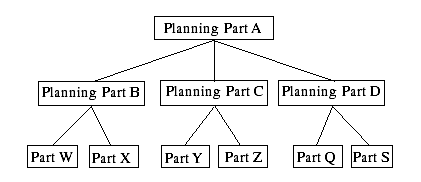

Planning Bills of Material

# Planning Bills of Material

A planning bill of material indirectly forecasts or
plans several parts by allowing you to manipulate the relationship
between the parent and subordinate parts and by providing a single
forecast or plan for the parent part. In some cases, planning bills
are multi-level. In this case, manipulating the top most parents
forecast results in all forecasts at the lower levels.

Planning parts are not real parts. To avoid putting planning parts
into the main part table, VISUAL uses a separate table, PLANNING\_PART.
This permits any number of levels to exist in the planning part table
through the planning bill of material table, PLANNING\_BOM. At the
lowest level, the planning bill of material refers to the actual part
table. This level can have no further planned parts below it.

## Example

In this example, there are two levels of planning parts and an additional
level of real parts. There is no requirement that all real parts occur
at the same level, only that they be the bottom most level.

Each relationship contains a percentage that dictates the quantity
of subordinate parts for each parent part. This allows the system
to determine the quantity of each subordinate part as a function of
the parent part forecast or plan.

You specify:

|  |  |
| --- | --- |
| Part ID | Percentage |
| Planning part A |  |
| Planning part B | 10% |
| Planning part C | 25% |
| Planning part D | 65% |

## VISUAL, given the following forecast, calculates these subordinate forecasts:

|  |  |  |  |  |  |  |  |
| --- | --- | --- | --- | --- | --- | --- | --- |
| ID | Week1 | Week2 | Week3 | Week4 | Week5 | Week6 | Week7 |
| A | 1000 | 1000 | 1400 | 950 | 3500 | 4500 | 2500 |
| B | 100 | 100 | 140 | 95 | 350 | 450 | 250 |
| C | 250 | 250 | 350 | 238 | 875 | 1125 | 625 |
| D | 650 | 650 | 910 | 617 | 2275 | 2925 | 1625 |

When calculating these values, VISUAL deals with rounding loss and
gain. The last part receives the balance from the parent part. This
means that percentages must total 100 at each set. This is evident
in Week 4 above.

The scale of forecast values is determined by the unit of measure
scale of the part in question. For instance, if a part is measured
in EA, the scale is 0, therefore; the numbers will be integers. If
a part is measured in LBS and the scale is 2, the numbers will be
decimal numbers having 2 places after the decimal point.

You can use Planning Bills of Material to derive either lower level
forecasts or lower level master schedules. Edit a planning parts
forecast causes calculation of the lower level planning data immediately.
There is no batch step, such as MRP, that needs to take place.

 User
Defined Information