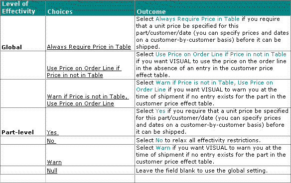

Price Effectivity in Shipping Entry

# Price Effectivity in Shipping Entry

You can control customer/part price effectivity at
two levels: the global level through Application Global Maintenance,
and the part level, through Part Maintenance.

In the absence of a part-specific effectivity preference (Yes, No,
or Warn), VISUAL uses the global setting. However if there is a part
preference specified, VISUAL uses that, and based on that preference
(Yes, No, or Warn,) allows, disallows, or warns you when trying to
ship the part to a customer.

 User-defined Help