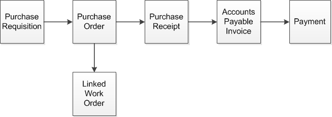

Purchasing Lifecycle

# Purchasing Lifecycle

You can access the Lifecycle Document Viewer in these Purchasing
modules:

* Purchase Requisition Entry
* Purchase Order Entry
* Purchasing Window
* Manufacturing Window
* Purchase Receipt Entry
* AP Invoices
* AP Payments

This diagram shows a complete purchasing lifecycle:

User-defined Help