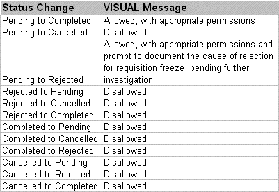

Reporting Task Completion

# Reporting Task Completion

Use Task Maintenance to report ECN task completion.
Only the user currently signed into the database can change the status
of an ECN task.

VISUAL segregates tasks according to User ID--that is, only the
user who is currently signed into the database can report task completion
against an ECN.

If the option [Generate All Options
Simultaneously](Setting_Up_ECNs.md) is active, VISUAL generates all ECN tasks at once
and displays them all in the table. Be sure, however, to report task
completion in the proper order, according to the ECN hierarchy: Authorization,
Implementation, Approval, and then Distribution.

If you try to change the status of a secondary task without first
changing the status of the primary task, VISUAL issues an error message.

For example, if User ID DESIGN30 is involved in each phase of ECN
completion (Authorization, Implementation, Approval, and Distribution),
VISUAL generates four separate tasks.

IF DESIGN30 tries to change the status of an Implementation task
to Completed before first changing the status of the Authorization
task to Completed, VISUAL issues a warning.

1. From the main VISUAL
   window, select Task Maintenance from
   the Purchasing or Eng/Mfg menu.

or

If you're currently working in the Requisition
Entry window, select Task Maintenance from
the File menu.

The Task Maintenance window appears

Only tasks assigned to the user currently
signed into the database appear. The title bar of the window shows
the User ID currently signed into the database.

|  |  |
| --- | --- |
| POSTIT.gifstyle="width: | Requisition task assignments also appear in this table. |

The table contains the following fields:

Task Type/#. Seq
- The type of task, number of the ECN, and number of the sequence.

If the task is linked to a requisition,
the type is REQ.

If the task is linked to an ECN, the type
is ECN.

Reference ID -
The ECN/Engineering Master this task is attached to.

Status - The current
status of the task. Tasks you report as completed prompt VISUAL to
update the completion meters in the tasks section of the main ECN
Entry window.

Sub Type - The
specific task within the ECN: Authorization,
Implementation, Approval,
Distribution, or Assigned
To.

Date Completed
- If the task is completed, the date on which the task was reported
as completed.

Specifications
- Any text regarding the task completion. After the user reports the
task as completed, VISUAL generates text for the status change and
prefaces it with a date and time stamp.

To modify specification text, double-click
the line. The Task Specifications dialog box appears. Click the Insert button to enter or modify text.

Reject Code -
If for some reason the task was rejected, VISUAL allows you to specify
a reject code and places it in this field.

Rejected Task ID
- The ID of the rejected task.

Create Date -
The date and time the task was created.

2. From the Status drop-down
   list, select the appropriate option:

Cancelled - Select
Cancelled if the task is no longer valid.

Completed - Select
Completed if the task sequence has been
approved and is completed.

Pending - Select
Pending, the default, is the task is still
pending.

Rejected - Select
Rejected to reject the task. Before you
can save, VISUAL prompts you to supply a reject code and explanatory
text.

|  |  |
| --- | --- |
| POSTIT.gifstyle="width: | If the global setting, "Passwords Required for Secure Fields," option is activated, VISUAL prompts you to enter your password before it attempts to change a status. |

The following status changes are not permitted:

3. Click the Save
   button to commit the status change.

If VISUAL prompts you for a password, enter
it into the Password field and click the Ok
button.

Depending on the status change (see above
table) VISUAL either changes the status or issues an error message.

4. Click the Ok
   button to continue. Refer to the table above for possible status
   changes.

 User-defined Help