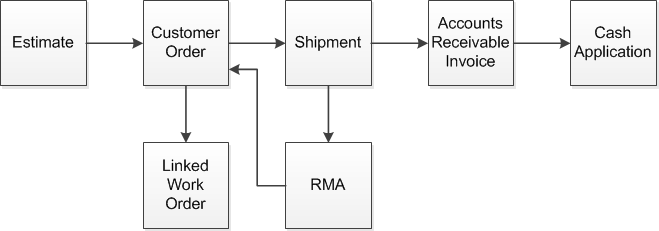

Sales Lifecycle

# Sales Lifecycle

You can access the Lifecycle Document Viewer in these Sales modules:

* Estimating Window
* Customer Order Entry
* Order Management Window
* Manufacturing Window
* Return Material Authorization
* Shipment Entry
* AR Invoices
* AR Payments

This diagram shows a complete sales lifecycle:

If a work order is allocated to a customer order, then the work
order is displayed in the lifecycle. If a new customer order is created
to address an RMA, then the new customer order is also included in
the lifecycle.

User-defined Help