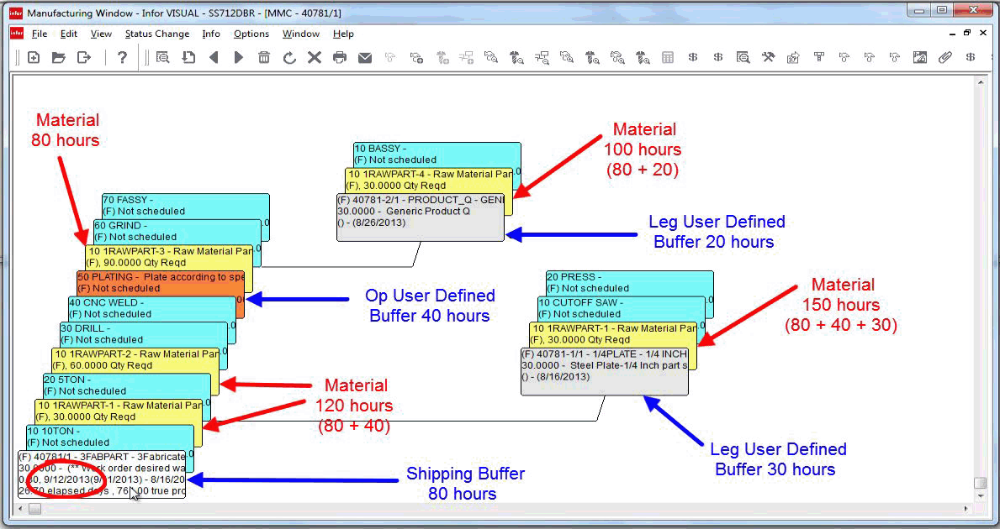

Setting Up User Defined Buffers for Made-to-Order Parts

# Setting Up User Defined Buffers for Made-to-Order Parts

You can specify additional buffer time for resources on made-to-order
parts only. You can specify this additional time on resources and
legs on your engineering masters or on individual work orders. When
you add a user-defined buffer to a resource or leg, the buffer time
is added to the shipping buffer. This provides extra protection to
the resource or leg and allows materials to be issued to the resource
or leg earlier.

To specify a user-defined buffer an a non-stocked part:

1. Select Eng/Mfg,
   Manufacturing Window.
2. Open the engineering
   master or work order to which you are applying a user-defined
   buffer.
3. Specify the user defined
   buffer:
4. To
   specify a user-defined buffer for an operation, open the operation
   card. Click the Other tab, and
   then specify the length of the buffer in hours in the Buffer Size
   (Hrs) field.
5. To specify
   a user-defined buffer for a leg, open the leg header card. Click
   the Specifications tab, and then
   specify the length of the buffer in hours in the Buffer Size (Hrs)
   field.

4. If you have not previously
   applied a buffer to the operation or leg, you are asked if you
   would like to update the buffer. Click Yes.
5. Click Save.

You can view information about the user-defined buffers applied
to your work orders in DBR Maintenance.

When you apply a user-defined buffer to an operation, the buffer
time is added to the shipping buffer for materials preceding the operation
where the buffer is applied. For example, if you applied a user-defined
buffer of 40 hours to operation 50, the user-defined buffer is applied
to material requirements for operations 10 through 40.

When you apply a user-defined buffer to a leg, the buffer time is
added to the material requirements used on the leg.

Multiple user-defined buffers can apply to materials. For example,
if a user-defined buffer of 40 hours was applied to operation 50,
and a leg with a user defined buffer of 30 is added to operation 10,
then both user-defined buffers are applied to the material requirements
on the leg.

This example demonstrates how user-defined buffers are applied.
These buffers are used:

Shipping buffer - 80 hours

User-defined buffer applied to operation 50
- 40 hours

User-defined buffer applied to leg on operation
10 - 30 hours

User-defined buffer applied to leg on operation
60 - 20 hours

In this example, the material requirements for operations 10 and
20 have a total buffer of 120 hours, or the shipping buffer plus the
user-defined buffer on operation 50.

The material requirement for operation 60 has a total buffer of
80, which is the shipping buffer.

The leg used on operation 10 has a total buffer of 150 hours, or
the shipping buffer plus the user-defined buffer on the leg plus the
buffer on operation 50.

The leg used on operation 60 has a total buffer of 100, or the shipping
buffer plus the user-defined buffer on the leg.