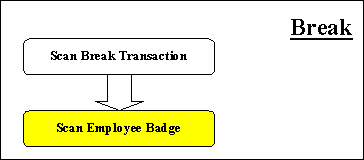

Transaction Briefs

# Transaction Briefs

This section reviews the parameters and the transactions,
logically grouped. While these transaction level briefs do not detail
the systems screens and user interaction, they do specify the behavior
of the transactions' functions.

## [Clocking In](javascript:void(0);)

A basic transaction fundamental to labor tracking is clocking in.

VISUAL ALTS processes an employee clocking-in in the following way:

* Employee Arrives at the
  facilities
* Clock In Transaction is
  scanned
* Employees badge or ID is
  scanned

## Employee and Transactional Scanning Requirements

In order for labor to be tracked efficiently through a facility,
it should be sufficiently labeled with barcodes. These barcode labels
vary in size shape and available information. VISUAL/ALTS interacts
with many label types and provide suitable means to scan labor and
transactional data via any of these various label types and scenarios.

## [Starting a Setup](javascript:void(0);)

A fundamental part of tracking production labor costs involves costing
the amount of setup time for an operation.

VISUAL ALTS processes setup starts in the following way:

* Employee is tasked with
  setting up an operation
* Start Setup Transaction
  is scanned
* Employees badge or ID is
  scanned
* Workorder Operation information
  is scanned (base/lot/split/sub/oper #)

## Workorder Operation Information

This information is currently available on the Work Order Traveller.

## [Starting a Run](javascript:void(0);)

A fundamental part of tracking production labor costs involves costing
the amount of run time for an operation.

VISUAL ALTS processes run starts in the following way:

* Employee is tasked with
  running an operation
* Start Run Transaction is
  scanned
* Employees badge or ID is
  scanned
* Workorder Operation information
  is scanned (base/lot/split/sub/oper #)

## Workorder Operation Information

This information is currently available on the Work Order Traveller.

## [Indirect](javascript:void(0);)

A fundamental part of tracking production labor costs involves costing
the amount of time an employee spends on non-production operations.

VISUAL ALTS processes indirect transactions in the following way:

* Employee is tasked with
  some type of indirect activity
* Indirect Transaction is
  scanned
* Employees badge or ID is
  scanned

## Indirect Codes

This information is currently available within a report from the
barcode labor entry windows.

## [Stopping a Job](javascript:void(0);)

A fundamental part of tracking production labor costs involves costing
the amount of run or setup time for an operation. To indicate when
either of these transactions are finished there is a Stop Job Transaction.

VISUAL ALTS processes job stoppages in the following way:

* Employee is finished with
  running or setup of an operation
* Stop Job Transaction is
  scanned
* Employees badge or ID is
  scanned
* Workorder Operation information
  is scanned (base/lot/split/sub/oper #)
* Qty completed is scanned
  to show progress in production
* Qty deviated is scanned
  to show quality ratios
* Employee is requested to
  indicate whether the operational activity is completed

## Workorder Operation Information

This information is currently available on the Work Order Traveller.

## [Breaks](javascript:TextPopup(this))

Break

A fundamental part of tracking production labor costs involves costing
the amount of time an employee spends on non-production activity.

VISUAL ALTS processes break transactions in the following way:

* Employee is allowed to cease
  activity
* Break Transaction is scanned
* Employees badge or ID is
  scanned

## [Clocking Out](javascript:void(0);)

The final transaction required that tracks production labor costs
is when an employee leaves the facilities, or clocks out for the day.

VISUAL ALTS processes clock-out transactions in the following way:

* Employee is allowed to leave
  facility
* Clock Out Transaction is
  scanned
* Employees badge or ID is
  scanned