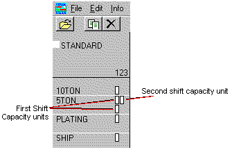

Understanding the Scheduling Window

# Understanding the Scheduling Window

The Scheduling Window uses a graph style display to
provide you with a lot of useful information on one screen. On the
vertical axis, resources are listed as defined in the Presentation
Sequence window of Shop Resource Maintenance. If you have not set
a presentation sequence, they appear in the order they were created.
Using the navigational arrows, you can advance on the date axis and
on the resource axis.

|  |  |
| --- | --- |
| POSTIT.gif | When you change Presentation Sequence, changes do not take effect until the next scheduling run. |

When you start the Scheduling Window, each tick-mark on the horizontal
axis represents a day of the month. The month and year are shown at
the first of each month. When you zoom-in to the point where a day
takes up most of the screen, individual hour marks appear as well.
The red numbered hours are AM, and the black numbers are PM.

A schedule appears only starting with the first shift of the current
date. The Loading Horizon parameter from the Edit menu controls how
many days of schedule are displayed from today. If operations that
should be scheduled farther out seem to be missing, you may need to
make this parameter larger.

The Shift Capacity boxes are the black outlined boxes to the right
of the resource. Each box indicates one unit of capacity for the specific
resource for each shift. One capacity unit is equivalent to the duration
of the shift. Therefore, if you have two machines available for the
1st shift, which is 8 hours long, the Scheduling Window displays 2
boxes stacked vertically under the 1 (first shift) heading. This equals
16 hours of capacity for the first shift.

The 1, 2, and 3 markings at the top of the column represent the
three shifts of the day. A capacity box in the 1 column, for example,
means the resource is available during the first shift. Note that
the exact hours available depends upon the setting in Shop Resource
Maintenance, or possibly in a calendar exception.

In the example below, there are two 5-ton presses available during
the first shift and one 5-ton press available during the second shift.

## Conventions

When operations appear in the Scheduling Window, a standard abbreviation
format is used to indicate the work order Base ID, Lot ID, Split ID,
Sub ID and operation sequence of the operation. The format is:

Work Order Base ID-Sub
ID/Lot ID.Split ID (Operation Sequence Number)

So Operation 40 of Sub ID 3 of Work Order 40009 Lot 2 Split 1 would
appear abbreviated as:

40009-3/2.1 (40)

When Sub ID and Split ID are zero, they are omitted from the abbreviation.
So Operation 40 of Sub ID 0 of Work Order 40009 Lot 2 Split 0 would
appear abbreviated as:

40009/2 (40)

 User-defined Help