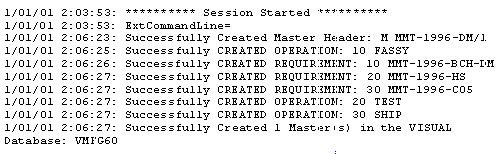

Viewing Log Information after Importing Data

# Viewing Log Information after Importing Data

After you import data into your VISUAL database you
can review the import session in the Vmdlsync.log file that the VISUAL
Data Import Utility creates as it imports the data. You can find this
file in the directory where your executables are installed.

Here is a section of a typical log file. This log file details the
importation and creation of a master header.

 User-defined Help