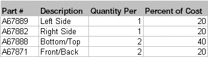

What are Co-products?

# What are Co-products?

A co-product is an additional part produced by a work
order, in addition to the main part. A work order or master specifies
a part in its header that is considered the main part of the order.
This part may or may not be assigned a part number. The co-product
list specifies the additional parts that are made with the main part.
All co-products must have part numbers; the part numbers are the primary
keys of the record.

Do not confuse co-products with by-products. A by-product is similar
to a co-product in that it is an additional part with value that is
created by a work order. The difference is in the method used to cost
the additional parts. Co-products are costed directly from work order
details and calculated based on a percentage of the entire order cost.
You can assign values to co-products much like materials are assigned
values.

For example, a group of stamp parts, each having a different form,
fit and function, but each produced from the same raw material at
the same time are co-products. The scrap material produced by stamping
is a by-product.

Continuing the example of stamp parts, consider a group of four
parts that are produced from a single sheet of stainless steel.

The first part has been selected as the main part. This is a fairly
arbitrary decision, except that it should not create difficult "quantity
per" relationships.

The percent of cost calculation distributes the cost of the entire
order to each individual part being produced. The above relationship
causes the following unit costs, assuming the order costs a total
of $1,000.

VISUAL computes the total cost of the order, apportions it to each
of the co-products including the main part, and then computes a unit
cost for each co-product.

 User-defined Help

Setting Up Co-products

 Linking Co-products to Customer Orders

 Linking Co-products to New Work Orders

 Linking Co-products to Existing Work
Orders

 Receiving Co-products into Inventory

Shipping Co-products

Netting Co-products

 Allocating Co-products to Demand

 Viewing Co-product Demand Allocation
Information