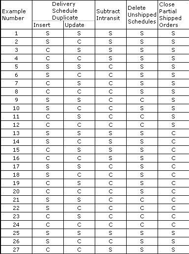

Working with Subtract Intransit Quantities

# Working with Subtract Intransit Quantities

When working with the Subtract Intransit Quantity
setting, it is important that you understand how the setting affects
the final quantity.

To understand how VISUAL handles quantity calculations using the
Subtract Intransit option, you may find it easier to study the following
examples:

Click the example you want to view.

 User-defined Help