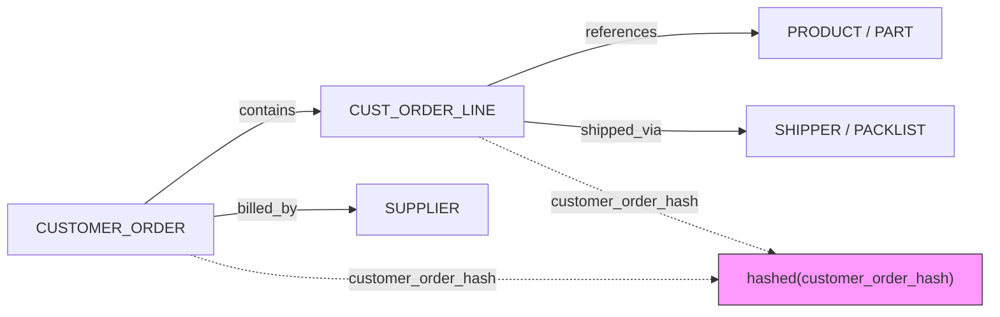
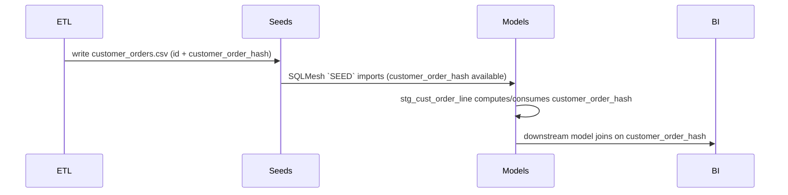

**SQLMesh Model ↔ Seed Specification — Customer Order Hashing**

Purpose
- Provide a clear specification for creating a model/seed interaction in SQLMesh that masks sensitive `CUSTOMER_ORDER.id` values by replacing direct identifiers with an MD5 hash. This enables joins while avoiding raw PII leakage.

Files/Locations
- Models output: `Utilities/SQLMesh/models/staging` (stg_* SQLMesh models)
- Seeds (CSV): `Utilities/SQLMesh/seeds` (CSV files consumed by SQLMesh `SEED` models)
- Generator script to modify: `scripts/modules/manufacturing_semantics/025_Entry_Point_DDL_to_SQLMesh_Part2.py`

Overview
- Strategy: compute an MD5 hash for `CUSTOMER_ORDER.id` when generating the seed CSV for customer orders, expose that hashed column (e.g. `customer_order_hash`) in the seed. In staging models, join using the hash column instead of the raw id.
- Benefits: preserves referential joinability while preventing storage of raw PII in downstream systems.

Seed generation (Python snippet)
- Add this snippet to the mock-data generator before writing the `customers.csv` (or `customer_orders.csv`) seed. It computes a stable MD5 hash from the canonical `id` and writes `customer_order_hash` as a 32-char hex digest.

```python
import hashlib

def add_customer_hash(row, id_field='id'):
    """Return MD5 hash string for the given id value."""
    raw = str(row.get(id_field, ''))
    return hashlib.md5(raw.encode('utf-8')).hexdigest()

# Example when building each CSV row (inside generator loop):
for r in customers_rows:
    r['customer_order_hash'] = add_customer_hash(r, id_field='id')

# Then write CSV with header including 'customer_order_hash'
```

Notes:
- You may choose to truncate the MD5 (e.g., first 10 chars) for shorter keys; keep truncation consistent across seed and model usage.
- To bind the hash to existing application semantics, use the canonical `CUSTOMER_ORDER.id` value before any transformations.

Model (SQLMesh staging example)
- Option A (preferred): include the hashed key in the staging `stg_customer_order` model by selecting the already-hashed column from the raw source (if provided by ETL). Example SQLMesh model content:

```sql
MODEL (
  name staging.stg_customer_order,
  kind FULL,
  grain (customer_order_hash)
);

SELECT
  customer_order_hash,
  -- other non-PII columns
  order_date,
  order_status
FROM raw.customer_order; -- assumes upstream ETL provides customer_order_hash
```

- Option B (if the raw table contains only the numeric `id` and you want to compute hash inside SQL): compute the MD5 in SQL when the DB supports it. Example (DuckDB/Postgres):

```sql
SELECT
  md5(CAST(id AS VARCHAR)) AS customer_order_hash,
  id as raw_id, -- avoid persisting raw_id in downstream
  order_date
FROM raw.customer_order;
```

Join pattern (cust_order_line)
- Replace direct join on `CO.ID = COL.CUST_ORDER_ID` with a join on hash keys. Two approaches:

- If raw `cust_order_line` already contains `cust_order_id` only, compute a hash for the line side at model-time (or create a seed for order-lines with hash). Example (compute at transform time):

```sql
-- In stg_cust_order_line.sql
MODEL (
  name staging.stg_cust_order_line,
  kind FULL
);

SELECT
  -- compute hash for the join key based on the line-side cust_order_id
  md5(CAST(cust_order_id AS VARCHAR)) AS customer_order_hash,
  line_no,
  part_id,
  order_qty
FROM raw.cust_order_line;
```

Then join in downstream models using `customer_order_hash`:

```sql
SELECT l.*, o.order_date
FROM staging.stg_cust_order_line l
JOIN staging.stg_customer_order o
  ON l.customer_order_hash = o.customer_order_hash;
```

Implementation checklist
- [ ] Add `customer_order_hash` generation to the `025` generator (see snippet).
- [ ] Ensure `customers`/`customer_order` seed CSV includes `customer_order_hash` column and is written to `Utilities/SQLMesh/seeds`.
- [ ] Update `stg_cust_order_line.sql` and `stg_customer_order.sql` (under `Utilities/SQLMesh/models/staging`) to expose and use the hashed keys.
- [ ] Run SQLMesh materialization steps and validate joins.

Security & integrity notes
- Treat the original `id` as sensitive: do not include `raw_id` in any seed or staging output unless absolutely required and encrypted.
- Use HMAC (with a secret key) instead of raw MD5 if you require non-reversibility and secret binding. MD5 alone is deterministic but not keyed; HMAC-SHA256 is recommended for stronger protection.

Mermaid logical diagrams
- Logical ER diagram showing the masked join key and core entities. Copy these `mermaid` blocks into Markdown or documentation pages that render Mermaid.

1) Entity relationships (simplified)



2) Logical join flow (masking pipeline)



Quick commands
- Generate seeds (example): run the modified generator

```bash
python scripts/modules/manufacturing_semantics/025_Entry_Point_DDL_to_SQLMesh_Part2.py --output Utilities/SQLMesh/seeds --rows 100
```

- Generate models (if using earlier script):

```bash
python scripts/modules/manufacturing_semantics/024_Entry_Point_DDL_to_SQLMesh.py --output Utilities/SQLMesh/models/staging
```

Example: small sanity-check SQL (DuckDB-compatible)

```sql
-- join orders to lines using hashed key (uses seed-provided hashes)
SELECT l.*, o.order_date
FROM staging.stg_cust_order_line l
JOIN staging.stg_customer_order o
  ON l.customer_order_hash = o.customer_order_hash
LIMIT 100;
```

If you want, I can:
- Patch the `025` generator to automatically add `customer_order_hash` for `customer_order` rows and `stg_cust_order_line` entries.
- Commit the spec file to the repo (it's saved at `Documentation/Models/sqlmesh_model_seed_spec.md`).

----
Generated: Documentation/Models/sqlmesh_model_seed_spec.md
