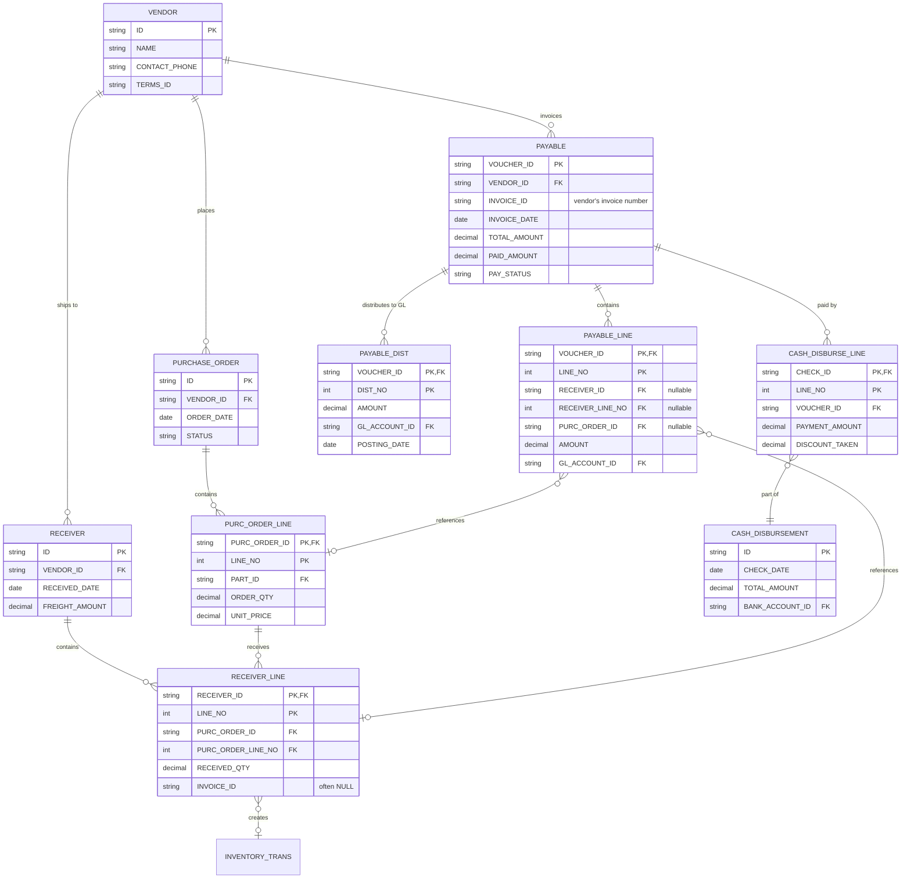

# Payables Tables Reference

Complete schema reference for Accounts Payable (AP) related tables in the ERP system.

## Quick Links
- [Table List](#key-payables-tables)
- [Entity Relationship Diagram](#er-diagram)
- [Common Join Patterns](#common-join-patterns)
- [Important Notes](#important-notes)

## Key Payables Tables

### Invoice & Payment Tables

#### PAYABLE (Header)
**File:** [Tables/dbo.PAYABLE.sql](Tables/dbo.PAYABLE.sql)

Primary vendor invoice header table.

**Key Columns:**
- `VOUCHER_ID` (PK) - Unique voucher/invoice identifier
- `VENDOR_ID` - Supplier reference
- `INVOICE_ID` - Vendor's invoice number
- `INVOICE_DATE` - Invoice date
- `PAYMENT_DATE` - Due date for payment
- `TOTAL_AMOUNT` - Total invoice amount
- `PAID_AMOUNT` - Amount paid to date
- `PAY_STATUS` - Payment status (O=Open, C=Closed, etc.)
- `SITE_ID` - Business site/location

**Foreign Keys:**
- `VENDOR_ID` → `VENDOR.ID`
- `SITE_ID` → `SITE.ID`
- `PAYB_GL_ACCT_ID` → `ACCOUNT.ID` (AP control account)

---

#### PAYABLE_LINE (Line Items)
**File:** [Tables/dbo.PAYABLE_LINE.sql](Tables/dbo.PAYABLE_LINE.sql)

Individual line items on vendor invoices.

**Key Columns:**
- `VOUCHER_ID`, `LINE_NO` (PK) - Composite key
- `RECEIVER_ID`, `RECEIVER_LINE_NO` - Link to goods receipt (if PO-based)
- `PURC_ORDER_ID`, `PURC_ORDER_LINE_NO` - Link to purchase order
- `AMOUNT` - Line amount
- `QTY` - Quantity
- `GL_ACCOUNT_ID` - Expense/asset account
- `WORKORDER_BASE_ID` - Link to work order (if job-related)
- `PROJECT_ID` - Link to project (if project-related)

**Foreign Keys:**
- `VOUCHER_ID` → `PAYABLE.VOUCHER_ID`

**Important:** Use `RECEIVER_ID` + `RECEIVER_LINE_NO` to join to `RECEIVER_LINE`, not just `INVOICE_ID`.

---

#### PAYABLE_DIST (GL Distribution)
**File:** [Tables/dbo.PAYABLE_DIST.sql](Tables/dbo.PAYABLE_DIST.sql)

General ledger accounting entries generated from payables.

**Key Columns:**
- `VOUCHER_ID`, `DIST_NO`, `ENTRY_NO`, `CURRENCY_ID` (PK) - Composite key
- `AMOUNT` - Transaction amount
- `AMOUNT_TYPE` - Debit/Credit indicator
- `GL_ACCOUNT_ID` - GL account impacted
- `POSTING_DATE` - Accounting date
- `POSTING_STATUS` - Posted vs. unposted

**Foreign Keys:**
- `VOUCHER_ID` → `PAYABLE.VOUCHER_ID`
- `GL_ACCOUNT_ID` → `ACCOUNT.ID`

---

### Purchasing & Receipt Tables

#### PURCHASE_ORDER / PURC_ORDER_LINE
**Files:** 
- [Tables/dbo.PURCHASE_ORDER.sql](Tables/dbo.PURCHASE_ORDER.sql)
- [Tables/dbo.PURC_ORDER_LINE.sql](Tables/dbo.PURC_ORDER_LINE.sql)

Purchase orders issued to vendors.

**PURCHASE_ORDER Key Columns:**
- `ID` (PK) - PO number
- `VENDOR_ID` - Vendor reference
- `ORDER_DATE` - PO date
- `STATUS` - PO status
- `BUYER_ID` - Buyer/purchaser

**PURC_ORDER_LINE Key Columns:**
- `PURC_ORDER_ID`, `LINE_NO` (PK)
- `PART_ID` - Part being purchased
- `ORDER_QTY` - Ordered quantity
- `UNIT_PRICE` - Purchase price
- `RECEIVED_QTY` - Quantity received to date

---

#### RECEIVER / RECEIVER_LINE
**Files:**
- [Tables/dbo.RECEIVER.sql](Tables/dbo.RECEIVER.sql)
- [Tables/dbo.RECEIVER_LINE.sql](Tables/dbo.RECEIVER_LINE.sql)

Goods receipts from vendors (receiving transactions).

**RECEIVER Key Columns:**
- `ID` (PK) - Receipt number
- `VENDOR_ID` - Vendor reference
- `RECEIVED_DATE` - Receipt date
- `FREIGHT_AMOUNT` - Actual freight charges

**RECEIVER_LINE Key Columns:**
- `RECEIVER_ID`, `LINE_NO` (PK)
- `PURC_ORDER_ID`, `PURC_ORDER_LINE_NO` - Link to PO line
- `RECEIVED_QTY` - Quantity received
- `INVOICE_ID` - Vendor invoice number (often NULL until invoiced)
- `TRANSACTION_ID` - Link to `INVENTORY_TRANS`
- `UNIT_PRICE` - Actual unit cost

**Important:** `INVOICE_ID` is frequently NULL on `RECEIVER_LINE` because goods are received before the invoice arrives. Do not rely on this field for joins to `PAYABLE`.

---

### Master Data Tables

#### VENDOR
**File:** [Tables/dbo.VENDOR.sql](Tables/dbo.VENDOR.sql)

Vendor/supplier master data.

**Key Columns:**
- `ID` (PK) - Vendor ID
- `NAME` - Vendor name
- `ADDR_1`, `ADDR_2`, `CITY`, `STATE`, `ZIPCODE` - Address
- `CONTACT_FIRST_NAME`, `CONTACT_LAST_NAME` - Contact person
- `CONTACT_PHONE`, `CONTACT_EMAIL` - Contact details
- `TERMS_ID` - Default payment terms
- `CURRENCY_ID` - Vendor's currency

---

#### PART
**File:** [Tables/dbo.PART.sql](Tables/dbo.PART.sql)

Part/material master data.

**Key Columns:**
- `ID` (PK) - Part number
- `DESCRIPTION` - Part description
- `PRODUCT_CODE` - Product classification
- `STD_COST` - Standard cost
- `PURCH_UM` - Purchase unit of measure

---

### Payment Tables

#### CASH_DISBURSE_LINE
**File:** [Tables/dbo.CASH_DISBURSE_LINE.sql](Tables/dbo.CASH_DISBURSE_LINE.sql)

Individual payment line items (which invoices are being paid).

**Key Columns:**
- `CHECK_ID`, `LINE_NO` (PK)
- `VOUCHER_ID` - Link to `PAYABLE.VOUCHER_ID`
- `PAYMENT_AMOUNT` - Amount paid
- `DISCOUNT_TAKEN` - Discount amount

**Foreign Keys:**
- `CHECK_ID` → `CASH_DISBURSEMENT.ID`

## ER Diagram



## Common Join Patterns

### 1. Payable to Vendor
```sql
SELECT 
    p.VOUCHER_ID,
    p.INVOICE_ID,
    v.NAME AS VENDOR_NAME,
    p.TOTAL_AMOUNT
FROM PAYABLE p
INNER JOIN VENDOR v ON p.VENDOR_ID = v.ID
```

### 2. Payable Line to Receiver Line (Goods-based Invoices)
```sql
SELECT 
    pl.VOUCHER_ID,
    pl.LINE_NO,
    rl.RECEIVER_ID,
    rl.RECEIVED_QTY,
    pl.AMOUNT
FROM PAYABLE_LINE pl
INNER JOIN RECEIVER_LINE rl 
    ON pl.RECEIVER_ID = rl.RECEIVER_ID 
    AND pl.RECEIVER_LINE_NO = rl.LINE_NO
WHERE pl.RECEIVER_ID IS NOT NULL
```

**Important:** Always use both `RECEIVER_ID` AND `RECEIVER_LINE_NO` in the join condition.

### 3. Receiver Line to Purchase Order Line
```sql
SELECT 
    rl.RECEIVER_ID,
    rl.LINE_NO,
    po.ID AS PO_NUMBER,
    pol.PART_ID,
    pol.ORDER_QTY,
    rl.RECEIVED_QTY
FROM RECEIVER_LINE rl
INNER JOIN PURC_ORDER_LINE pol 
    ON rl.PURC_ORDER_ID = pol.PURC_ORDER_ID 
    AND rl.PURC_ORDER_LINE_NO = pol.LINE_NO
INNER JOIN PURCHASE_ORDER po 
    ON pol.PURC_ORDER_ID = po.ID
```

### 4. Complete Purchase-to-Pay Flow
```sql
SELECT 
    po.ID AS PO_NUMBER,
    r.ID AS RECEIPT_NUMBER,
    p.VOUCHER_ID,
    p.INVOICE_ID,
    v.NAME AS VENDOR_NAME,
    pol.PART_ID,
    pol.ORDER_QTY,
    rl.RECEIVED_QTY,
    pl.AMOUNT
FROM PURCHASE_ORDER po
INNER JOIN PURC_ORDER_LINE pol ON po.ID = pol.PURC_ORDER_ID
INNER JOIN RECEIVER_LINE rl 
    ON pol.PURC_ORDER_ID = rl.PURC_ORDER_ID 
    AND pol.LINE_NO = rl.PURC_ORDER_LINE_NO
INNER JOIN RECEIVER r ON rl.RECEIVER_ID = r.ID
LEFT JOIN PAYABLE_LINE pl 
    ON rl.RECEIVER_ID = pl.RECEIVER_ID 
    AND rl.LINE_NO = pl.RECEIVER_LINE_NO
LEFT JOIN PAYABLE p ON pl.VOUCHER_ID = p.VOUCHER_ID
INNER JOIN VENDOR v ON po.VENDOR_ID = v.ID
```

### 5. Payable Aging (Open Invoices)
```sql
SELECT 
    p.VOUCHER_ID,
    p.INVOICE_ID,
    v.NAME AS VENDOR_NAME,
    p.INVOICE_DATE,
    p.PAYMENT_DATE AS DUE_DATE,
    p.TOTAL_AMOUNT,
    p.PAID_AMOUNT,
    (p.TOTAL_AMOUNT - p.PAID_AMOUNT) AS BALANCE_DUE,
    DATEDIFF(day, p.PAYMENT_DATE, GETDATE()) AS DAYS_OVERDUE
FROM PAYABLE p
INNER JOIN VENDOR v ON p.VENDOR_ID = v.ID
WHERE p.PAY_STATUS = 'O'  -- Open status
ORDER BY p.PAYMENT_DATE
```

### 6. Payment History
```sql
SELECT 
    cd.ID AS CHECK_NUMBER,
    cd.CHECK_DATE,
    p.VOUCHER_ID,
    p.INVOICE_ID,
    v.NAME AS VENDOR_NAME,
    cdl.PAYMENT_AMOUNT,
    cdl.DISCOUNT_TAKEN
FROM CASH_DISBURSEMENT cd
INNER JOIN CASH_DISBURSE_LINE cdl ON cd.ID = cdl.CHECK_ID
INNER JOIN PAYABLE p ON cdl.VOUCHER_ID = p.VOUCHER_ID
INNER JOIN VENDOR v ON p.VENDOR_ID = v.ID
WHERE cd.CHECK_DATE >= '2024-01-01'
ORDER BY cd.CHECK_DATE DESC
```

## Important Notes

### RECEIVER_LINE.INVOICE_ID Often NULL

The `RECEIVER_LINE.INVOICE_ID` field is frequently NULL because:
1. Goods are received before the invoice arrives
2. The system doesn't always populate this field even after invoicing

**Do NOT join** `RECEIVER_LINE` to `PAYABLE` using `INVOICE_ID`. Instead, use the proper join path:
```sql
-- CORRECT:
FROM RECEIVER_LINE rl
INNER JOIN PAYABLE_LINE pl 
    ON rl.RECEIVER_ID = pl.RECEIVER_ID 
    AND rl.LINE_NO = pl.RECEIVER_LINE_NO

-- WRONG:
FROM RECEIVER_LINE rl
INNER JOIN PAYABLE p ON rl.INVOICE_ID = p.INVOICE_ID  -- BAD!
```

### Non-PO Invoices

Not all payables are PO-based. Some invoices are entered directly without a purchase order:
- Utilities, rent, professional services
- One-time purchases
- Credit card charges

For these invoices:
- `PAYABLE_LINE.PURC_ORDER_ID` will be NULL
- `PAYABLE_LINE.RECEIVER_ID` will be NULL
- Amount goes directly to an expense GL account

### Payment Terms

Payment terms affect cash flow calculations:
- `TERMS_NET_DAYS` - Payment due in X days
- `TERMS_DISC_DAYS` - Discount available if paid within X days
- `TERMS_DISC_PERCENT` - Discount percentage (e.g., 2% for 2/10 Net 30)

### Currency Handling

Many payables tables have both:
- Transaction currency amounts (vendor's currency)
- Base currency amounts (company's reporting currency)
- `SELL_RATE`, `BUY_RATE` - Exchange rates used

### Three-Way Match

Standard AP process follows three-way match:
1. **Purchase Order** - What we ordered
2. **Receiver** - What we received  
3. **Payable** - What the vendor invoiced

Exceptions occur when these don't match:
- Price variance (PO price ≠ invoice price)
- Quantity variance (received qty ≠ invoiced qty)
- Unexpected charges (freight, tax differences)

## Related Documentation

- **[Schema README](README.md)** - Schema overview and common patterns
- **[TABLE_INDEX.md](TABLE_INDEX.md)** - Complete table listing
- **[Payables Data Models](../Data%20Models/Payables/)** - Query examples and analysis
- **[Payables Invoice/Voucher Flow](../Data%20Models/Payables/payables_invoice_voucher_flow.md)** - Detailed AP workflow

## Additional Payables-Related Tables

Other tables that may be useful for payables analysis:

- **PAYABLE_INST** - Installment payment schedules
- **PAYABLE_CURR** - Multi-currency details
- **PURCHASE_DIST** - PO-level GL distributions
- **PURC_REQUISITION** / **PURC_REQ_LINE** - Purchase requisitions
- **TERMS** - Payment terms master
- **BANK_ACCOUNT** - Bank accounts for disbursements
- **ACCOUNT** - Chart of accounts (GL accounts)
- **SITE** - Business locations/entities
