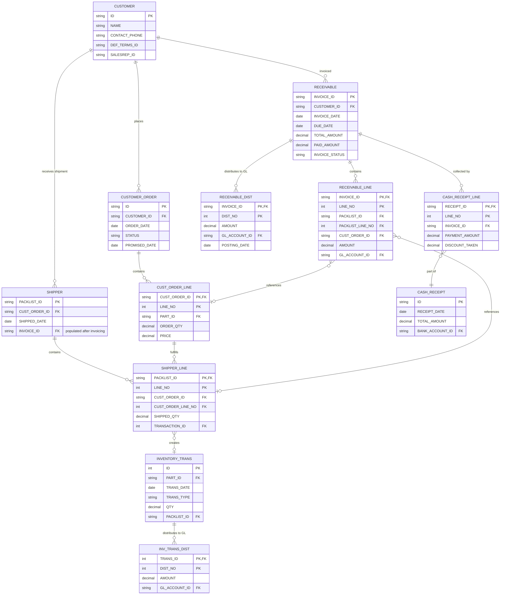

# Receivables Tables Reference

Complete schema reference for Accounts Receivable (AR) related tables in the ERP system.

## Quick Links
- [Table List](#key-receivables-tables)
- [Entity Relationship Diagram](#er-diagram)
- [Common Join Patterns](#common-join-patterns)
- [Important Notes](#important-notes)

## Key Receivables Tables

### Invoice & Collection Tables

#### RECEIVABLE (Header)
**File:** [Tables/dbo.RECEIVABLE.sql](Tables/dbo.RECEIVABLE.sql)

Primary customer invoice header table.

**Key Columns:**
- `INVOICE_ID` (PK) - Unique invoice identifier
- `CUSTOMER_ID` - Customer reference
- `INVOICE_DATE` - Invoice date
- `DUE_DATE` - Payment due date
- `TOTAL_AMOUNT` - Total invoice amount
- `PAID_AMOUNT` - Amount paid to date
- `INVOICE_STATUS` - Status (O=Open, C=Closed, etc.)
- `SITE_ID` - Business site/location

**Foreign Keys:**
- `CUSTOMER_ID` → `CUSTOMER.ID`
- `SITE_ID` → `SITE.ID`
- `RECV_GL_ACCT_ID` → `ACCOUNT.ID` (AR control account)

---

#### RECEIVABLE_LINE (Line Items)
**File:** [Tables/dbo.RECEIVABLE_LINE.sql](Tables/dbo.RECEIVABLE_LINE.sql)

Individual line items on customer invoices.

**Key Columns:**
- `INVOICE_ID`, `LINE_NO` (PK) - Composite key
- `PACKLIST_ID`, `PACKLIST_LINE_NO` - Link to shipment (if shipment-based)
- `CUST_ORDER_ID`, `CUST_ORDER_LINE_NO` - Link to sales order
- `AMOUNT` - Line amount
- `QTY` - Quantity
- `GL_ACCOUNT_ID` - Revenue account
- `VAT_AMOUNT` - Tax amount
- `COMMISSION_PCT` - Sales commission percentage

**Foreign Keys:**
- `INVOICE_ID` → `RECEIVABLE.INVOICE_ID`
- `CUST_ORDER_ID`, `CUST_ORDER_LINE_NO` → `CUST_ORDER_LINE`

---

#### RECEIVABLE_DIST (GL Distribution)
**File:** [Tables/dbo.RECEIVABLE_DIST.sql](Tables/dbo.RECEIVABLE_DIST.sql)

General ledger accounting entries generated from receivables.

**Key Columns:**
- `INVOICE_ID`, `DIST_NO`, `ENTRY_NO`, `CURRENCY_ID` (PK) - Composite key
- `AMOUNT` - Transaction amount
- `AMOUNT_TYPE` - Debit/Credit indicator
- `GL_ACCOUNT_ID` - GL account impacted
- `POSTING_DATE` - Accounting date
- `POSTING_STATUS` - Posted vs. unposted

**Foreign Keys:**
- `INVOICE_ID` → `RECEIVABLE.INVOICE_ID`
- `GL_ACCOUNT_ID` → `ACCOUNT.ID`

---

### Sales Order & Shipment Tables

#### CUSTOMER_ORDER / CUST_ORDER_LINE
**Files:**
- [Tables/dbo.CUSTOMER_ORDER.sql](Tables/dbo.CUSTOMER_ORDER.sql)
- [Tables/dbo.CUST_ORDER_LINE.sql](Tables/dbo.CUST_ORDER_LINE.sql)

Sales orders from customers.

**CUSTOMER_ORDER Key Columns:**
- `ID` (PK) - Order number
- `CUSTOMER_ID` - Customer reference
- `ORDER_DATE` - Order date
- `STATUS` - Order status
- `PROMISED_DATE` - Promised delivery date

**CUST_ORDER_LINE Key Columns:**
- `CUST_ORDER_ID`, `LINE_NO` (PK)
- `PART_ID` - Part being sold
- `ORDER_QTY` - Ordered quantity
- `PRICE` - Unit price
- `SHIPPED_QTY` - Quantity shipped to date

---

#### SHIPPER / SHIPPER_LINE
**Files:**
- [Tables/dbo.SHIPPER.sql](Tables/dbo.SHIPPER.sql)
- [Tables/dbo.SHIPPER_LINE.sql](Tables/dbo.SHIPPER_LINE.sql)

Goods shipments to customers (packlists).

**SHIPPER Key Columns:**
- `PACKLIST_ID` (PK) - Packlist/shipment number
- `CUST_ORDER_ID` - Link to sales order
- `SHIPPED_DATE` - Ship date
- `INVOICE_ID` - Customer invoice (often populated after shipping)
- `INVOICED_DATE` - Invoice date
- `STATUS` - Shipment status

**SHIPPER_LINE Key Columns:**
- `PACKLIST_ID`, `LINE_NO` (PK)
- `CUST_ORDER_ID`, `CUST_ORDER_LINE_NO` - Link to order line
- `SHIPPED_QTY` - Quantity shipped
- `UNIT_PRICE` - Actual price
- `TRANSACTION_ID` - Link to `INVENTORY_TRANS`
- `GL_REVENUE_ACCT_ID` - Revenue account

---

### Inventory Transaction Tables

#### INVENTORY_TRANS
**File:** [Tables/dbo.INVENTORY_TRANS.sql](Tables/dbo.INVENTORY_TRANS.sql)

Material movements and inventory transactions.

**Key Columns:**
- `ID` (PK) - Transaction ID
- `PART_ID` - Part reference
- `TRANS_DATE` - Transaction date
- `TRANS_TYPE` - Transaction type (S=Sale, R=Receipt, A=Adjustment, etc.)
- `QTY` - Quantity moved
- `PACKLIST_ID`, `PACKLIST_LINE_NO` - Link to shipment (for sales)
- `RECEIVER_ID`, `RECEIVER_LINE_NO` - Link to receipt (for purchases)
- `STD_COST` - Standard cost per unit
- `ACTUAL_COST` - Actual cost per unit

**Foreign Keys:**
- `PART_ID` → `PART.ID`
- `WAREHOUSE_ID` → `WAREHOUSE.ID`
- `LOCATION_ID` → `LOCATION.ID`

---

#### INV_TRANS_DIST
**File:** [Tables/dbo.INV_TRANS_DIST.sql](Tables/dbo.INV_TRANS_DIST.sql)

GL accounting entries for inventory transactions.

**Key Columns:**
- `TRANS_ID`, `DIST_NO`, `ENTRY_NO` (PK) - Composite key
- `TRANS_ID` - Link to `INVENTORY_TRANS.ID`
- `GL_ACCOUNT_ID` - GL account (COGS, Inventory, etc.)
- `AMOUNT` - Transaction amount
- `AMOUNT_TYPE` - Debit/Credit indicator

**Foreign Keys:**
- `TRANS_ID` → `INVENTORY_TRANS.ID`
- `GL_ACCOUNT_ID` → `ACCOUNT.ID`

---

### Master Data Tables

#### CUSTOMER
**File:** [Tables/dbo.CUSTOMER.sql](Tables/dbo.CUSTOMER.sql)

Customer master data.

**Key Columns:**
- `ID` (PK) - Customer ID
- `NAME` - Customer name
- `ADDR_1`, `ADDR_2`, `CITY`, `STATE`, `ZIPCODE` - Address
- `CONTACT_FIRST_NAME`, `CONTACT_LAST_NAME` - Contact person
- `CONTACT_PHONE`, `CONTACT_EMAIL` - Contact details
- `DEF_TERMS_ID` - Default payment terms
- `CURRENCY_ID` - Customer's currency
- `SALESREP_ID` - Default sales representative

---

#### PART
**File:** [Tables/dbo.PART.sql](Tables/dbo.PART.sql)

Part/product master data.

**Key Columns:**
- `ID` (PK) - Part number
- `DESCRIPTION` - Part description
- `PRODUCT_CODE` - Product classification
- `STD_COST` - Standard cost
- `SALES_UM` - Sales unit of measure

---

### Collection Tables

#### CASH_RECEIPT_LINE
**File:** [Tables/dbo.CASH_RECEIPT_LINE.sql](Tables/dbo.CASH_RECEIPT_LINE.sql)

Individual receipt line items (which invoices are being paid).

**Key Columns:**
- `RECEIPT_ID`, `LINE_NO` (PK)
- `INVOICE_ID` - Link to `RECEIVABLE.INVOICE_ID`
- `PAYMENT_AMOUNT` - Amount received
- `DISCOUNT_TAKEN` - Discount amount

**Foreign Keys:**
- `RECEIPT_ID` → `CASH_RECEIPT.ID`
- `INVOICE_ID` → `RECEIVABLE.INVOICE_ID`

## ER Diagram



## Common Join Patterns

### 1. Receivable to Customer
```sql
SELECT 
    r.INVOICE_ID,
    r.INVOICE_DATE,
    c.NAME AS CUSTOMER_NAME,
    r.TOTAL_AMOUNT
FROM RECEIVABLE r
INNER JOIN CUSTOMER c ON r.CUSTOMER_ID = c.ID
```

### 2. Receivable Line to Shipper Line (Shipment-based Invoices)
```sql
SELECT 
    rl.INVOICE_ID,
    rl.LINE_NO,
    sl.PACKLIST_ID,
    sl.SHIPPED_QTY,
    rl.AMOUNT
FROM RECEIVABLE_LINE rl
INNER JOIN SHIPPER_LINE sl 
    ON rl.PACKLIST_ID = sl.PACKLIST_ID 
    AND rl.PACKLIST_LINE_NO = sl.LINE_NO
WHERE rl.PACKLIST_ID IS NOT NULL
```

### 3. Shipper Line to Customer Order Line
```sql
SELECT 
    sl.PACKLIST_ID,
    sl.LINE_NO,
    co.ID AS ORDER_NUMBER,
    col.PART_ID,
    col.ORDER_QTY,
    sl.SHIPPED_QTY
FROM SHIPPER_LINE sl
INNER JOIN CUST_ORDER_LINE col 
    ON sl.CUST_ORDER_ID = col.CUST_ORDER_ID 
    AND sl.CUST_ORDER_LINE_NO = col.LINE_NO
INNER JOIN CUSTOMER_ORDER co 
    ON col.CUST_ORDER_ID = co.ID
```

### 4. Complete Order-to-Cash Flow
```sql
SELECT 
    co.ID AS ORDER_NUMBER,
    s.PACKLIST_ID,
    r.INVOICE_ID,
    c.NAME AS CUSTOMER_NAME,
    col.PART_ID,
    col.ORDER_QTY,
    sl.SHIPPED_QTY,
    rl.AMOUNT
FROM CUSTOMER_ORDER co
INNER JOIN CUST_ORDER_LINE col ON co.ID = col.CUST_ORDER_ID
INNER JOIN SHIPPER_LINE sl 
    ON col.CUST_ORDER_ID = sl.CUST_ORDER_ID 
    AND col.LINE_NO = sl.CUST_ORDER_LINE_NO
INNER JOIN SHIPPER s ON sl.PACKLIST_ID = s.PACKLIST_ID
LEFT JOIN RECEIVABLE_LINE rl 
    ON sl.PACKLIST_ID = rl.PACKLIST_ID 
    AND sl.LINE_NO = rl.PACKLIST_LINE_NO
LEFT JOIN RECEIVABLE r ON rl.INVOICE_ID = r.INVOICE_ID
INNER JOIN CUSTOMER c ON co.CUSTOMER_ID = c.ID
```

### 5. Receivables Aging (Open Invoices)
```sql
SELECT 
    r.INVOICE_ID,
    c.NAME AS CUSTOMER_NAME,
    r.INVOICE_DATE,
    r.DUE_DATE,
    r.TOTAL_AMOUNT,
    r.PAID_AMOUNT,
    (r.TOTAL_AMOUNT - r.PAID_AMOUNT) AS BALANCE_DUE,
    DATEDIFF(day, r.DUE_DATE, GETDATE()) AS DAYS_OVERDUE,
    CASE 
        WHEN DATEDIFF(day, r.DUE_DATE, GETDATE()) <= 0 THEN 'Current'
        WHEN DATEDIFF(day, r.DUE_DATE, GETDATE()) <= 30 THEN '1-30 Days'
        WHEN DATEDIFF(day, r.DUE_DATE, GETDATE()) <= 60 THEN '31-60 Days'
        WHEN DATEDIFF(day, r.DUE_DATE, GETDATE()) <= 90 THEN '61-90 Days'
        ELSE 'Over 90 Days'
    END AS AGING_BUCKET
FROM RECEIVABLE r
INNER JOIN CUSTOMER c ON r.CUSTOMER_ID = c.ID
WHERE r.INVOICE_STATUS = 'O'  -- Open status
ORDER BY r.DUE_DATE
```

### 6. Payment History
```sql
SELECT 
    cr.ID AS RECEIPT_NUMBER,
    cr.RECEIPT_DATE,
    r.INVOICE_ID,
    c.NAME AS CUSTOMER_NAME,
    crl.PAYMENT_AMOUNT,
    crl.DISCOUNT_TAKEN
FROM CASH_RECEIPT cr
INNER JOIN CASH_RECEIPT_LINE crl ON cr.ID = crl.RECEIPT_ID
INNER JOIN RECEIVABLE r ON crl.INVOICE_ID = r.INVOICE_ID
INNER JOIN CUSTOMER c ON r.CUSTOMER_ID = c.ID
WHERE cr.RECEIPT_DATE >= '2024-01-01'
ORDER BY cr.RECEIPT_DATE DESC
```

### 7. Sales with Inventory Movement
```sql
SELECT 
    s.PACKLIST_ID,
    s.SHIPPED_DATE,
    sl.LINE_NO,
    it.PART_ID,
    p.DESCRIPTION AS PART_DESCRIPTION,
    sl.SHIPPED_QTY,
    it.STD_COST,
    sl.UNIT_PRICE,
    (sl.UNIT_PRICE - it.STD_COST) AS GROSS_MARGIN_PER_UNIT,
    ((sl.UNIT_PRICE - it.STD_COST) * sl.SHIPPED_QTY) AS TOTAL_MARGIN
FROM SHIPPER s
INNER JOIN SHIPPER_LINE sl ON s.PACKLIST_ID = sl.PACKLIST_ID
INNER JOIN INVENTORY_TRANS it ON sl.TRANSACTION_ID = it.ID
INNER JOIN PART p ON it.PART_ID = p.ID
WHERE s.SHIPPED_DATE >= '2024-01-01'
  AND it.TRANS_TYPE = 'S'  -- Sales transaction
```

### 8. Revenue Recognition by GL Account
```sql
SELECT 
    itd.GL_ACCOUNT_ID,
    a.DESCRIPTION AS ACCOUNT_NAME,
    SUM(itd.AMOUNT) AS TOTAL_REVENUE,
    COUNT(DISTINCT it.PACKLIST_ID) AS SHIPMENT_COUNT
FROM INVENTORY_TRANS it
INNER JOIN INV_TRANS_DIST itd ON it.ID = itd.TRANS_ID
INNER JOIN ACCOUNT a ON itd.GL_ACCOUNT_ID = a.ID
WHERE it.TRANS_TYPE = 'S'
  AND it.TRANS_DATE >= '2024-01-01'
  AND itd.AMOUNT_TYPE = 'CR'  -- Credit to revenue
GROUP BY itd.GL_ACCOUNT_ID, a.DESCRIPTION
ORDER BY TOTAL_REVENUE DESC
```

## Important Notes

### Invoice Timing

Invoices can be created:
1. **At shipment** - Invoice generated immediately when goods ship
2. **After shipment** - Invoice created later (periodic billing, milestone billing)
3. **Before shipment** - Advance/prepayment invoices

Check `SHIPPER.INVOICE_ID` and `SHIPPER.INVOICED_DATE` to understand timing.

### Shipment-to-Invoice Relationship

- `SHIPPER.INVOICE_ID` links the shipment to its invoice
- Multiple shipments can be combined on one invoice (consolidated billing)
- One shipment can generate multiple invoices (split billing)

Use `RECEIVABLE_LINE.PACKLIST_ID` to trace invoice lines back to shipments.

### Direct Invoices (No Shipment)

Not all receivables are shipment-based. Some invoices are created directly:
- Service invoices
- Consulting/professional services
- Recurring charges (maintenance, subscriptions)
- Finance charges

For these invoices:
- `RECEIVABLE_LINE.PACKLIST_ID` will be NULL
- Amount goes directly to service revenue GL accounts

### Inventory Transaction Types

Common `INVENTORY_TRANS.TRANS_TYPE` values:
- `S` - Sale/shipment
- `R` - Receipt from vendor
- `A` - Adjustment
- `T` - Transfer between locations
- `I` - Issue to manufacturing
- `M` - Manufacturing receipt

For receivables analysis, focus on `TRANS_TYPE = 'S'`.

### Revenue vs. COGS

Inventory movements generate both revenue and COGS:
- **Revenue** - `INV_TRANS_DIST` with credit entry to revenue account
- **COGS** - `INV_TRANS_DIST` with debit entry to COGS account
- **Inventory relief** - `INV_TRANS_DIST` with credit entry to inventory account

### Sales Commissions

Sales rep commissions tracked at:
- `RECEIVABLE_LINE.COMMISSION_PCT` - Commission percentage
- Calculate commission: `RECEIVABLE_LINE.AMOUNT * COMMISSION_PCT / 100`

### Payment Terms

Payment terms affect collections forecasting:
- `TERMS_NET_DAYS` - Payment due in X days
- `TERMS_DISC_DAYS` - Discount available if paid within X days
- `TERMS_DISC_PERCENT` - Early payment discount percentage

### Currency Handling

Many receivables tables have both:
- Transaction currency amounts (customer's currency)
- Base currency amounts (company's reporting currency)
- `SELL_RATE`, `BUY_RATE` - Exchange rates used

### Order-to-Cash Process

Standard AR process follows:
1. **Customer Order** - Customer places order
2. **Shipment** - Goods are shipped (packlist created)
3. **Invoice** - Customer is invoiced
4. **Collection** - Payment is received

Exceptions occur when:
- Partial shipments (multiple shipments per order line)
- Back orders (ship less than ordered)
- Consolidated invoicing (multiple shipments on one invoice)
- Split shipments to multiple locations

## Related Documentation

- **[Schema README](README.md)** - Schema overview and common patterns
- **[TABLE_INDEX.md](TABLE_INDEX.md)** - Complete table listing
- **[Receivables Data Models](../Data%20Models/Receivables/)** - Query examples and analysis

## Additional Receivables-Related Tables

Other tables that may be useful for receivables analysis:

- **RECEIVABLE_SHARE** - Revenue sharing arrangements
- **RECEIVABLE_INST** - Installment payment schedules
- **RECEIVABLE_CURR** - Multi-currency details
- **SHIPMENT_DIST** - Shipment-level GL distributions
- **REVENUE_DIST** - Revenue recognition distributions
- **SALES_TAX_GROUP** - Sales tax configurations
- **TERMS** - Payment terms master
- **BANK_ACCOUNT** - Bank accounts for receipts
- **ACCOUNT** - Chart of accounts (GL accounts)
- **SALESREP** - Sales representative master
- **SITE** - Business locations/entities
- **SHIPTO_ADDRESS** - Ship-to addresses for customers
